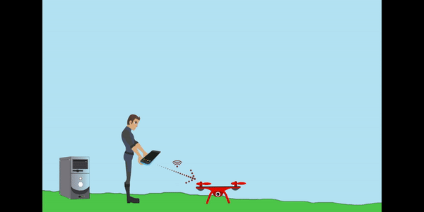

**Mission Statement** 
--- 

`Eagle Eye` is a fully autonomous reconnaissance system that combines drone automation and cutting edge machine learning to assist first responders to efficiently locate and save the lives of displaced individuals during critical hours after a natural disaster hits.


**Demonstration**
---
```Brief Overview GIF```



**Full Length Presentation**
---
For a full presentation, motivation behind the project, technical details, and plans for the future. 

Watch our Youtube video. [`EagleEye`](https://youtu.be/q-rHi6GOTD4)
